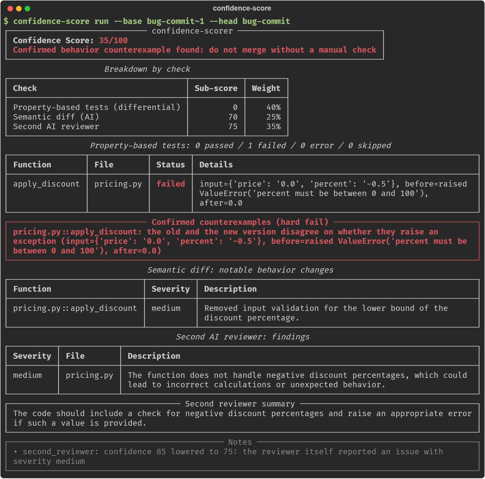
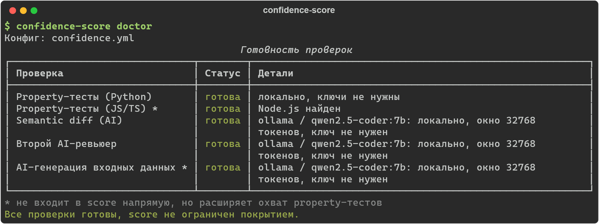

# confidence-scorer

[](https://github.com/Kakadu525/confidence-scorer/actions/workflows/tests.yml)
[](pyproject.toml)
[](LICENSE)

[English](README.md) | **Русский**

Оценка уверенности для AI-сгенерированных PR и диффов. Перед мержем дифф
проходит три независимые проверки, и на выходе получается score 0-100 с
вердиктом: можно мержить, нужно ревью или мержить нельзя.



<sub>Настоящий прогон на демо из <a href="example_demo/">example_demo/</a>: все три проверки на локальной модели qwen2.5-coder:7b через Ollama.</sub>

## Содержание

- [Зачем](#зачем)
- [Быстрый старт](#быстрый-старт)
- [Как это работает](#как-это-работает)
- [Установка](#установка)
- [AI-ключи и модели](#ai-ключи-и-модели)
- [CLI](#cli)
- [Конфигурация](#конфигурация-confidenceyml)
- [GitHub Action](#github-action)
- [Безопасность](#безопасность)
- [Ограничения](#ограничения)
- [Разработка](#разработка)

## Зачем

AI пишет всё больше PR. Такие диффы выглядят опрятно, проходят линтер и
часто даже юнит-тесты. Только тесты писал тот же AI, что и код, поэтому они
подтверждают, что AI написал задуманное, и ничего не говорят о том, ведёт ли
себя код как раньше. Ревьюер-человек не успевает читать каждый такой PR так же
внимательно, как раньше. confidence-scorer берёт на себя часть этой работы:

1. Property-based differential testing. Для каждой изменённой функции
   генерируются случайные и намеренно граничные входные данные, старая и новая
   версия вызываются на одних и тех же входах, результаты сравниваются. Если
   поведение разошлось, в отчёт попадает воспроизводимый контрпример.
2. Semantic diff. AI описывает, что изменилось в поведении каждой функции
   (форматирование не в счёт), и оценивает риск.
3. Второй AI-ревьюер. Смотрит на весь дифф целиком, не видя выводов первых двух
   проверок, и выставляет свою оценку уверенности со списком замечаний.

Три числа сворачиваются в один score с настраиваемыми весами и порогами.
Подтверждённый контрпример для публичной функции жёстко ограничивает итоговый
score сверху, что бы ни сказали AI-ревьюеры (секция `hard_fail` в конфиге).

## Быстрый старт

```bash
pip install -e ".[all]"              # из корня репозитория; [all] = SDK Anthropic и OpenAI
cd confidence_scorer/js_helpers && npm install && cd ../..   # нужно для JS/TS-проверок

confidence-score init                # создать confidence.yml (необязательно, есть дефолты)
```

Задайте ключи. Оба необязательны, подробности в разделе
[«AI-ключи и модели»](#ai-ключи-и-модели).

```bash
# bash / zsh / Git Bash
export ANTHROPIC_API_KEY=...
export OPENAI_API_KEY=...
```

```powershell
# PowerShell (Windows): действует до закрытия окна терминала
$env:ANTHROPIC_API_KEY = "..."
$env:OPENAI_API_KEY = "..."
```

Проверьте, что ключи подхватились. `doctor` ничего не отправляет в API и
денег не тратит, он только показывает, какие проверки заработают:

```bash
confidence-score doctor
confidence-score run --base main --head HEAD
```



В [`example_demo/`](example_demo/) лежит демонстрация: реальный баг, который
ловит property-тест, и безопасный рефакторинг, который этот тест проходит.

## Как это работает

```
                      git diff (base...head)
                              │
             ┌────────────────┴─────────────────┐
             │ изменённые файлы .py / .js / .ts │
             └────────────────┬─────────────────┘
                              │
           AST/Babel-diff: какие функции реально изменились
                              │
        ┌─────────────────────┼─────────────────────┐
        │                     │                     │
        ▼                     ▼                     ▼
 1. differential        2. semantic diff     3. второй AI-ревьюер
 property-testing       (AI, по функциям)    (AI, весь diff целиком)
 (Hypothesis /                                свежий взгляд, не видит
  fast-check,                                 выводы (1) и (2)
  без AI: типы
  или AI как fallback
  для генераторов)
        │                     │                     │
        └─────────────────────┼─────────────────────┘
                              ▼
                    scoring.py: weighted score
                    + hard-fail правила
                              │
                              ▼
                 score 0-100 + вердикт + отчёт
            (terminal / markdown-комментарий в PR / JSON)
```

### 1. Differential property-based testing

Проверяются только изменённые функции: у добавленных и удалённых нет второй
версии для сравнения. Для каждой из них confidence-scorer:

1. Строит генератор входных данных. Если у параметров есть type hints
   (`int`, `str`, `list[int]`, `Optional[str]`, TS `number`/`string`/...),
   генератор строится напрямую, без AI. Если типов нет, генератор может
   предложить AI (`providers.strategy_generation` в конфиге). Его ответ не
   исполняется через `eval`/`exec`: он разбирается по фиксированному списку
   разрешённых стратегий (`confidence_scorer/checks/strategy_builder.py`), и
   ничего сверх этого списка AI передать не может.
2. Генерирует около 50 входов (настраивается) со смещением к граничным
   значениям: 0, ±1, ±2, ±3 и так далее. Чисто случайный поиск по всему
   диапазону `int` такие баги почти не находит.
3. Вызывает старую и новую версию функции на каждом входе и сравнивает
   результат и факт исключения.
4. Найденное расхождение Hypothesis или fast-check сжимают до минимального
   контрпримера, он и попадает в отчёт.

Поддерживаются функции верхнего уровня модуля на Python и JS/TS (через Node,
Babel и fast-check). Методы классов не поддерживаются, см.
[«Ограничения»](#ограничения).

Прогоны детерминированы: `hypothesis.seed` и `js.seed` по умолчанию
фиксированы, и при перезапуске CI один и тот же PR получает тот же вердикт.
С `seed: null` каждый прогон ищет новые входы, но результат может меняться
от запуска к запуску.

### 2. Semantic diff

На каждую изменённую функцию уходит отдельный AI-запрос со старой и новой
версией исходника. Модель перечисляет поведенческие изменения с severity и
ставит общую оценку риска 0-100. Эта проверка ловит то, что трудно найти
случайными входами: изменения контракта, обработки ошибок, побочных эффектов
и документированного поведения.

### 3. Второй AI-ревьюер

Один AI-запрос на весь дифф. Промпт прямо говорит модели, что код мог написать
AI, что к нему стоит отнестись скептически и что никто его ещё не проверял.
В ответ приходят confidence 0-100, вердикт одной фразой и список замечаний.

По умолчанию `semantic_diff` и `second_reviewer` работают у разных
провайдеров, Anthropic и OpenAI, чтобы второе мнение не повторяло слепые пятна
первой модели. Любую другую комбинацию можно задать в `confidence.yml`
(секция `providers:`).

### Свёртка в score

```
overall = Σ(sub_score_i × weight_i) по проверкам, которые смогли отработать
```

Если проверка не отработала (нет AI-ключа, нет подходящих изменённых функций),
она исключается, а её вес пропорционально делится между остальными. Если не
отработала ни одна, score равен N/A, а не 100.

Одного перераспределения весов мало. Без AI-ключей property-тесты могли бы
проверить одну тривиальную функцию, и прогон выдал бы 100/100 «можно
мержить». Поэтому итог дополнительно ограничивается потолком по покрытию:

```
coverage = Σ(вес проверки × её полнота) / (сумма всех весов)
cap      = evidence.min_cap + (100 - evidence.min_cap) × coverage
overall  = min(overall, cap)
```

Полнота property-тестов и semantic diff равна 1 или 0 (отработали или нет), у
панели ревьюеров это доля ответивших участников по весу.

На дефолтных настройках один property-тест (вес 0.40) даёт потолок 70, то есть
вердикт «рекомендуется ревью». Отчёт всегда показывает покрытие и сработавший
потолок. Отключить потолок можно через `evidence.enabled: false`.

Технические ошибки провалом не считаются. Статус `error` (не установлен
модуль, упал воркер, истёк таймаут) значит «проверить не удалось»: такие
функции не входят в знаменатель sub-score и перечисляются в примечаниях.

Оценка модели не может противоречить её же находкам. В одном из живых прогонов
второй ревьюер нашёл удалённую проверку границы с severity `high` и в том же
ответе поставил confidence 100. Поэтому `confidence` второго ревьюера и
`risk_score` каждой функции в semantic diff ограничиваются худшей из найденных
моделью проблем: при `high` не выше 40, при `medium` не выше 75. Исходное
значение остаётся в JSON-отчёте, а понижение объясняется в примечаниях.

При `hard_fail.enabled: true` (по умолчанию) подтверждённый контрпример для
публичной функции ограничивает `overall` значением
`hard_fail.cap_score_on_confirmed_counterexample` (по умолчанию 35).

## Установка

```bash
pip install -e ".[all]"            # рекомендуется: пакет + SDK Anthropic и OpenAI
pip install -e ".[anthropic]"      # только Anthropic (если ключ OpenAI не нужен)
pip install -e .                   # без SDK: AI-проверки работать не будут

cd confidence_scorer/js_helpers && npm install      # JS/TS-проверки (опционально)
```

SDK провайдеров ставятся отдельно. Если ключ задан, а SDK нет, проверка
пропускается, и отчёт вместе с `confidence-score doctor` пишет, какой пакет
доставить.

Нужен Python 3.10 или новее. Для JS/TS-проверок нужен Node.js 18+. Без него
JS/TS property-тесты пропускаются с причиной в отчёте, остальное работает.

## AI-ключи и модели

### Какая проверка какой ключ использует

| Проверка | Что делает | Вызовов на прогон | Ключ по умолчанию |
|---|---|---|---|
| `semantic_diff` | описывает поведенческие изменения каждой функции | по одному на изменённую функцию (до 25) | `ANTHROPIC_API_KEY` |
| `second_reviewer` | независимое ревью всего диффа | 1 | `OPENAI_API_KEY` |
| `strategy_generation` | строит генераторы входных данных для функций без type hints | по одному на такую функцию | `ANTHROPIC_API_KEY` |
| property-тесты | запускают старую и новую версию функции | 0 | не нужен |

Второй ревьюер по умолчанию работает у другого провайдера, чем semantic diff:
у моделей одного провайдера общие слепые пятна.

### Что будет, если ключ один или ключей нет

Проверка без ключа пропускается, прогон не падает. Score при этом ограничен
долей отработавших проверок ([потолок по покрытию](#свёртка-в-score)):

| Ключи | Что работает | Потолок score |
|---|---|---|
| оба | всё | 100 |
| только Anthropic, конфиг по умолчанию | всё, кроме второго ревьюера | 82 |
| только Anthropic, ревьюер переключён на `anthropic` | всё | 100 |
| нет ни одного | только property-тесты | 70 |
| нет ни одного, AI-проверки на локальной Ollama | всё | 100 |

Ревьюер переключается на Anthropic в `confidence.yml`. Готовый вариант есть
в шаблоне `confidence-score init`, закомментированный:

```yaml
providers:
  second_reviewer:
    provider: anthropic
    model: claude-opus-5
```

### Как получить ключ

Подписка Claude Pro/Max или ChatGPT Plus доступа к API не даёт: это отдельные
продукты с отдельной оплатой. Без пополненного API-баланса ключ создастся, но
все запросы с ним будут отклонены.

- Anthropic: [console.anthropic.com](https://console.anthropic.com) →
  Billing (пополнить баланс) → API Keys → Create Key.
- OpenAI: [platform.openai.com](https://platform.openai.com) →
  Billing → API keys → Create new secret key.

Ключ показывается один раз, скопируйте его сразу. Для тестового ключа
поставьте лимит трат в консоли провайдера.

Ключи не пишутся в `confidence.yml`. Их место в переменных окружения
(локально) или в GitHub Secrets (для Action).

### Модели и стоимость

По умолчанию все задачи Anthropic выполняет `claude-opus-5`. Модель и глубину
размышлений можно задать для каждой проверки отдельно:

| Модель | Вход / выход, $ за 1M токенов | Когда брать |
|---|---|---|
| `claude-opus-5` | 5 / 25 | по умолчанию; лучшая точность ревью |
| `claude-sonnet-5` | 2 / 10 | дешевле; разумно для `semantic_diff` и `strategy_generation` |
| `claude-haiku-4-5` | 1 / 5 | самая дешёвая, для узких задач |

```yaml
providers:
  semantic_diff:
    provider: anthropic
    model: claude-opus-5
    effort: medium        # low | medium | high | xhigh | max; по умолчанию high
```

`effort` задаёт глубину размышлений. `low` и `medium` быстрее и дешевле, и для
узкой задачи вроде semantic diff их часто хватает, но проверьте это на своих
PR. Параметр действует только для Anthropic.

Небольшой PR стоит центы, крупный (25 изменённых функций) обходится примерно
в доллар. Повторный прогон того же PR почти бесплатный благодаря
[кэшу](#конфигурация-confidenceyml): оплачиваются только изменившиеся функции.

### Бесплатные и дешёвые модели

Любую из трёх AI-проверок можно отдать другому провайдеру, поменяв `provider`
и `model` в `confidence.yml`:

| `provider` | Стоимость | Ключ | Куда уходит код |
|---|---|---|---|
| `ollama` | бесплатно | не нужен | никуда, модель работает на вашем компьютере |
| `deepseek` | платно, но в десятки раз дешевле Opus | `DEEPSEEK_API_KEY` | DeepSeek |
| `qwen` | обычно есть стартовая бесплатная квота, проверьте в консоли | `DASHSCOPE_API_KEY` | Alibaba Cloud |
| `openrouter` + модель с `:free` | бесплатно, 50 запросов в день (1000 после покупки кредитов от $10) | `OPENROUTER_API_KEY` | OpenRouter и провайдер модели |
| `openai_compatible` | зависит от сервера | `api_key_env` в конфиге, если нужен | ваш сервер (`base_url`) |

Условия бесплатных тарифов меняются, проверяйте их на сайте провайдера перед
выбором. Бесплатные облачные тарифы могут сохранять запросы, а в запросах ваш
код. Если это недопустимо, используйте Ollama.

Бесплатные чат-версии claude.ai и ChatGPT API не дают, а подключение к ним
через эмуляцию браузера нарушает их условия использования и грозит блокировкой
аккаунта. GitHub Models, где раньше был бесплатный доступ к моделям OpenAI,
закрыт с 30 июля 2026 года.

#### Ollama: бесплатно и локально

```bash
ollama pull qwen2.5-coder:7b     # ~4,7 ГБ; хватает видеокарты на 8 ГБ
```

```yaml
providers:
  strategy_generation: { provider: ollama, model: qwen2.5-coder:7b }
  semantic_diff:       { provider: ollama, model: qwen2.5-coder:7b }
  second_reviewer:     { provider: ollama, model: qwen2.5-coder:7b }
limits:
  max_parallel_ai_calls: 1   # одна видеокарта, запросы всё равно идут по очереди
```

`confidence-score doctor` проверит, что Ollama запущена и модель скачана.

Что стоит знать:

- Окно контекста задаётся автоматически. По умолчанию у Ollama оно 4 096
  токенов, и более длинный промпт сервер молча обрезает с начала, то есть
  ровно там, где лежит дифф. Модель после этого уверенно оценивает код,
  которого не видела. Поэтому провайдер обращается к родному API Ollama и
  запрашивает окно 32 768 токенов (`context_window` в конфиге). Если дифф не
  помещается и в него, ответ отклоняется с причиной в отчёте.
- Оценки воспроизводимы: запросы идут с `temperature: 0` и фиксированным
  `seed`, и один и тот же PR получает одну и ту же оценку.
- Первый запрос медленный, около 45 секунд на видеокарте с 8 ГБ: модель
  загружается в видеопамять. Дальше демо-PR проверяется за 4-7 секунд, а
  повторный прогон того же PR берётся из кэша за секунду.
- Модель на 7B заметно слабее Opus. На демо-баге она замечает удалённую
  проверку, но ставит ей `medium`, а на безопасном рефакторинге иногда
  выдумывает несуществующее изменение. Это бесплатное дополнение к
  property-тестам, сильного ревьюера она не заменит.
- Если `ollama pull` падает с `server gave HTTP response to HTTPS client`,
  сервер Ollama ходит в интернет мимо вашего VPN или прокси, а на прямом
  маршруте CDN с файлами моделей заблокирован. Задайте `HTTPS_PROXY` для
  самого приложения Ollama (или включите в VPN-клиенте режим, который
  перехватывает трафик всех программ) и повторите `ollama pull`.

### Панель ревьюеров

Вторым ревьюером может быть панель из нескольких моделей, например сильная
облачная и бесплатная локальная:

```yaml
providers:
  second_reviewer:
    - { provider: anthropic, model: claude-opus-5,    weight: 2 }
    - { provider: ollama,    model: qwen2.5-coder:7b, weight: 1 }
```

- Оценка панели считается как взвешенное среднее оценок ответивших
  участников. Оценку каждого сначала ограничивают его же находки (`high` не
  выше 40, `medium` не выше 75), потом она идёт в среднее. Шумный участник
  сдвигает итог, но не определяет его.
- Если кто-то не ответил (нет ключа, упёрся в лимит, Ollama не запущена),
  оценка считается по ответившим, а потолок score снижается пропорционально
  весу молчавших. В отчёте видно, кто выпал и почему.
- Сильное расхождение, от 40 пунктов между оценками, попадает в примечания.
  На score оно не влияет, но замечания в таком случае стоит прочитать самому.
- Замечания всех участников выводятся вместе, у каждого указано, кто его
  нашёл. Похожие замечания разных моделей не склеиваются, потому что сравнение
  свободного текста ненадёжно.
- `weight` по умолчанию 1. `label` задаёт имя в отчёте, по умолчанию это
  `provider/model`. Одна и та же модель дважды считается ошибкой конфига.

Каждый участник делает отдельный вызов модели, так что панель из трёх стоит
как три ревьюера. Для semantic diff панели нет: там вызовов и так столько же,
сколько функций.

### Поведение моделей, о котором стоит знать

- Модель может отклонить запрос по решению классификатора безопасности.
  Изредка это случается с диффами про криптографию или разбор сетевых пакетов.
  Провайдер включает серверные fallbacks, и API перезапускает отклонённый
  запрос на рекомендованной резервной модели. Если отказала вся цепочка,
  проверка этой функции пропускается и не засчитывается ни как «опасно», ни
  как «безопасно».
- Лимит ответа рассчитан с запасом на размышления. У Claude Opus 5 thinking
  включён по умолчанию и делит `max_tokens` с ответом, поэтому лимит равен
  16 000 токенов, хотя сам JSON намного меньше. Оплачиваются только реально
  сгенерированные токены.

## CLI

```bash
confidence-score [--lang en|ru] <команда> ...
  # язык вывода для этого запуска; важнее, чем `language:` в confidence.yml

confidence-score init [--path confidence.yml] [--force]
  # с --lang ru шаблон создаётся с русскими комментариями и `language: ru`

confidence-score doctor [--repo PATH] [--config PATH]
  # какие проверки заработают с текущими ключами, SDK и Node.js, и какой будет
  # потолок score; ничего не отправляет в API

confidence-score run
  --base REF            # базовый ref (по умолчанию merge-base с origin/main)
  --head REF|WORKTREE   # целевой ref (по умолчанию рабочее дерево)
  --repo PATH            # путь к репозиторию (по умолчанию .)
  --config PATH          # путь к confidence.yml (по умолчанию ищется в репозитории)
  --format terminal|json|markdown
  --json-out PATH        # дополнительно сохранить JSON-отчёт
  --markdown-out PATH    # дополнительно сохранить Markdown для комментария в PR
  --fail-under N         # переопределить thresholds.fail_below
  --no-gate              # всегда exit code 0 (только информативно)
  --debug                # полная трассировка при ошибке
```

Exit code равен `1`, если сработал `hard_fail` или `overall` ниже
`thresholds.fail_below` (либо `--fail-under`), иначе `0`. На этом построен
merge gate: GitHub Action ниже превращает его в обязательную проверку.

## Конфигурация (`confidence.yml`)

Полная схема с дефолтами и комментариями лежит в
[`confidence_scorer/config.py`](confidence_scorer/config.py) (`DEFAULT_CONFIG_TEMPLATE`),
тот же файл создаёт `confidence-score init`. Основные секции:

| Секция | Что делает |
|---|---|
| `language` | язык отчёта в терминале, комментария в PR, примечаний и замечаний AI: `en` (по умолчанию) или `ru` |
| `languages` | какие языки диффа анализировать (`python`, `javascript`) |
| `exclude` | globs, которые никогда не анализируются (тесты, vendor, dist...) |
| `weights` | веса трёх проверок в итоговом score (нормализуются автоматически) |
| `thresholds` | границы `pass_at` / `warn_below` / `fail_below` |
| `hard_fail` | включён ли hard-fail и до какого score он ограничивает итог |
| `hypothesis` | `max_examples`, таймауты на функцию и на файл, `seed` для Python property-тестов |
| `js` | то же самое для JS/TS (`fast_check_examples`, таймауты, `seed`, путь к `node`) |
| `providers` | провайдер, модель и `effort` для каждой из трёх AI-задач, у второго ревьюера можно задать панель (см. [«AI-ключи и модели»](#ai-ключи-и-модели)) |
| `limits` | сколько функций максимум анализировать за прогон, размер diff, отправляемого в AI |
| `evidence` | потолок score при неполном покрытии проверками (`min_cap`) |
| `cache` | дисковый кэш ответов AI: повторный прогон того же PR не оплачивается заново |
| `execute_changed_code` | `false` полностью выключает выполнение диффа (см. [«Безопасность»](#безопасность)) |

В конфиге хранятся только имена переменных окружения с ключами, сами ключи
туда не пишутся.

### Язык отчётов

По умолчанию отчёты на английском. Чтобы получать их на русском, задайте
`language: ru` в `confidence.yml`, передайте `--lang ru` или выставьте
`CONFIDENCE_LANG=ru`. Флаг и переменная окружения важнее конфига. AI-проверки
тоже пишут замечания на выбранном языке; severity и ключи JSON не переводятся.

## GitHub Action

Нужны два workflow: первый считает score, второй публикует отчёт комментарием
в PR. В PR из форка GitHub не даёт ни секретов, ни прав на запись, поэтому
первый workflow не может написать комментарий сам. Второй запускается уже в
контексте вашего репозитория, код PR не скачивает и только публикует готовый
отчёт.

```yaml
# .github/workflows/confidence-score.yml
name: Confidence Score
on:
  pull_request:
    types: [opened, synchronize, reopened]
permissions:
  contents: read
jobs:
  score:
    runs-on: ubuntu-latest
    steps:
      - uses: actions/checkout@v7
        with:
          fetch-depth: 0   # обязательно: без полной истории не сравнить base...head

      - uses: Kakadu525/confidence-scorer@v1
        with:
          post-comment: "false"
          anthropic-api-key: ${{ secrets.ANTHROPIC_API_KEY }}
          openrouter-api-key: ${{ secrets.OPENROUTER_API_KEY }}

      - name: Сохранить номер PR
        if: always()
        env:
          PR_NUMBER: ${{ github.event.pull_request.number }}
        run: printf '%s\n' "$PR_NUMBER" > pr-number.txt

      - uses: actions/upload-artifact@v7
        if: always()
        with:
          name: confidence-report
          path: |
            report.md
            pr-number.txt
          if-no-files-found: ignore
```

Второй workflow скопируйте без изменений из этого репозитория:
[`.github/workflows/confidence-comment.yml`](.github/workflows/confidence-comment.yml).

Не заменяйте `pull_request` на `pull_request_target`, даже если комментарии
«не работают»: так код из форка выполнится с доступом к вашим секретам.

Если PR приходят только из веток этого же репозитория, хватит одного
workflow: уберите `post-comment: "false"` и шаги с артефактом, а в
`permissions` добавьте `pull-requests: write`.

Ключи провайдеров передаются входами `anthropic-api-key`, `openai-api-key`,
`openrouter-api-key`, `deepseek-api-key`, `dashscope-api-key`. Вход `language` (`en` или `ru`) задаёт язык комментария
в PR. Action выставляет outputs `score` и `verdict` и падает, если сработал merge gate,
поэтому его можно сделать обязательной проверкой (required status check).
Ещё есть output `gate` (`passed` или `failed`). Outputs доступны и после
падения Action, в шагах с `if: always()`. Если блокировать мерж не нужно,
поставьте `fail-on-gate: "false"`: Action только сообщит результат.

### Бесплатно в CI

Ollama на обычных раннерах GitHub не подходит: видеокарты там нет, а модель
пришлось бы скачивать при каждом запуске. Для CI бесплатно работают модели
OpenRouter с суффиксом `:free`:

```yaml
providers:
  strategy_generation: { provider: openrouter, model: <id модели>:free }
  semantic_diff:       { provider: openrouter, model: <id модели>:free }
  second_reviewer:     { provider: openrouter, model: <id другой модели>:free }
limits:
  max_parallel_ai_calls: 1
```

Без купленных кредитов OpenRouter даёт 50 бесплатных запросов в день, а
semantic diff тратит по запросу на каждую изменённую функцию. Для активного
репозитория этого мало: либо купите кредиты (лимит вырастет до 1000 в день),
либо оставьте на OpenRouter только второго ревьюера.

В PR из форков секреты недоступны, поэтому AI-проверки там пропускаются, а
score получает потолок по покрытию.

## Безопасность

Differential testing импортирует и исполняет обе версии кода из PR. Если
в диффе есть вредоносный код, он будет выполнен. Полноценной песочницы
(контейнер без сети и доступа к файлам) нет. Поэтому:

- запускайте проверку в CI на одноразовом раннере, а не на своей машине;
- используйте `pull_request`, а не `pull_request_target`;
- не передавайте раннеру секреты, которые проверке не нужны;
- в недоверенном окружении поставьте `execute_changed_code: false`: тогда код
  из PR не исполняется, остаются semantic diff и второй ревьюер.

Каждый файл тестируется в отдельном процессе с таймаутом на функцию и на файл.
Генераторы входных данных, которые предлагает модель, не исполняются как код:
они проходят через фиксированный список допустимых конструкций.

Дифф и код изменённых функций отправляются выбранным AI-провайдерам.
Бесплатные облачные тарифы могут сохранять запросы; если это недопустимо,
используйте Ollama.

## Ограничения

- Методы классов в differential testing не участвуют, только функции верхнего
  уровня. Для вызова метода нужен экземпляр класса, а собрать его
  автоматически, когда у конструктора произвольные зависимости, намного
  сложнее. Методы всё равно проверяют semantic diff и второй ревьюер.
- Вложенные функции и замыкания отдельно не извлекаются: их поведение
  неотделимо от внешней функции.
- `*args`, `**kwargs` и rest-параметры генератор входных данных не
  поддерживает. Такие функции получают статус `skipped`, а не пропускаются
  молча.
- Дифф-тестирование может найти расхождение на вырожденных входах, которые
  нарушают неявные предусловия. Например, `lo > hi` для функции, которая
  рассчитывает на `lo <= hi`. Багом в бытовом смысле это бывает не всегда, но
  поведение действительно разошлось, а насколько это важно, решает человек.
- JS/TS-воркер ограничивает время на функцию между прогонами property
  (`js.per_function_timeout_s`), но бесконечный цикл внутри одного вызова
  прервать не может: в Node синхронный код нельзя остановить из того же
  потока. Такой случай снимает таймаут на файл со стороны Python.
- Недетерминированные функции пропускаются. Если функция на одном и том же
  входе даёт разные результаты (`random`, `time`, сеть), расхождение не связано
  с диффом. Такая функция получает статус `skipped` с объяснением.
- Редкие «магические» значения не находятся. Регрессию вида
  `if n == 987654: return 0` случайный поиск не поймает: граничные значения
  перебираются детерминированно, но конкретные большие константы в этот
  перебор не входят. Так устроен любой property-based подход, и такие случаи
  остаются на semantic diff и второго ревьюера.
- Semantic diff и второй ревьюер зависят от качества модели. Это
  вероятностные оценки, формальной верификацией они не являются.

## Разработка

```bash
pip install -e ".[dev]"
cd confidence_scorer/js_helpers && npm install && cd -   # для JS/TS-тестов

pytest -q                                   # тесты
pytest -q --cov=confidence_scorer           # с покрытием
ruff check confidence_scorer tests          # линтер

# живой тест на локальной Ollama (по умолчанию пропускается)
CONFIDENCE_OLLAMA_MODEL=qwen2.5-coder:7b pytest -q -k live
```

Тесты JS/TS-пути пропускаются, если Node или зависимости `js_helpers` не
установлены. CI (`.github/workflows/tests.yml`) гоняет матрицу Linux/Windows ×
Python 3.10/3.12. Windows в матрице нужен потому, что таймаут на функцию там
устроен иначе (без SIGALRM), и регрессию в этом месте видно только на нём.

Структура проекта:

```
confidence_scorer/
  cli.py                     # click CLI: init / doctor / run
  doctor.py                  # готовность проверок: ключи, SDK, Node, потолок score
  pipeline.py                # склеивает всё в один прогон
  config.py                  # pydantic-схема confidence.yml + шаблон init
  presets.py                 # адреса и ключи провайдеров: ollama, deepseek, qwen, openrouter
  git_diff.py                # git diff -> список изменённых файлов
  scoring.py                 # свёртка 3 sub-score в overall + вердикт
  extractors/
    python_extractor.py      # AST-diff изменённых функций (Python)
    js_extractor.py          # Babel-diff изменённых функций (JS/TS)
  checks/
    property_tests.py        # оркестрация differential testing (Python)
    js_property_tests.py     # то же для JS/TS
    strategy_builder.py      # type hint -> Hypothesis strategy, AI-spec allowlist
    js_strategy.py           # TS type -> spec (Python-порт для оркестратора)
    semantic_diff.py         # AI: поведенческие изменения функции
    second_reviewer.py       # AI: независимое ревью всего диффа
    review_panel.py          # панель ревьюеров: параллельный запуск и сведение оценок
    _diff_worker.py          # subprocess-воркер: реальный запуск Python-функций
    severity.py              # оценка AI не выше, чем допускают его же находки
  ai/
    anthropic_provider.py    # Claude: fallbacks при отказах, кэшируемый system
    openai_provider.py       # OpenAI и любые OpenAI-совместимые API (DeepSeek, Qwen, OpenRouter)
    ollama_provider.py       # локальная Ollama через родной API (окно контекста в запросе)
    cache.py                 # дисковый кэш ответов (ключ = провайдер+модель+effort+промпт)
    prompts.py               # промпты трёх AI-задач
  js_helpers/                # Node: extract.js, diff_worker.js, spec_to_arbitrary.js
  report/                    # terminal (rich) / markdown (PR-комментарий) / json
action.yml                   # GitHub Action
.github/
  workflows/confidence-score.yml   # score для PR
  workflows/confidence-comment.yml # комментарий с отчётом, в том числе для PR из форков
  workflows/tests.yml        # тесты проекта: Linux/Windows × Python 3.10/3.12 + ruff
example_demo/                 # воспроизводимая демонстрация (баг + safe-рефакторинг)
```
