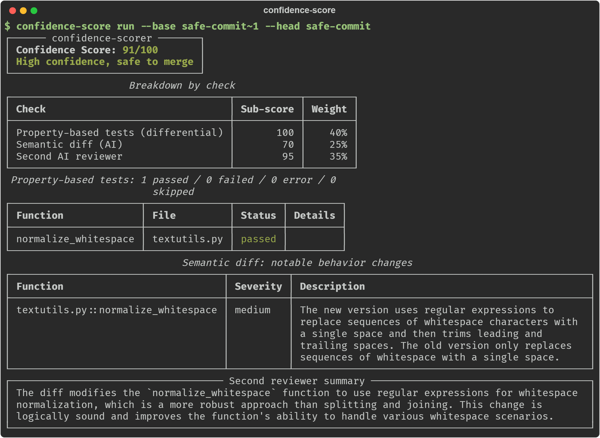

# Demo

**English** | [Русский](README.ru.md)

`setup_demo.sh` builds a throwaway git repository with two commits that
imitate changes made by an AI.

1. `bug-commit` (`pricing.py`). The AI "simplified" the validation in
   `apply_discount` and dropped the lower bound check (`percent < 0`). The
   one-line diff looks like a harmless refactoring. Differential property
   testing finds a counterexample in a fraction of a second: with
   `percent = -0.5` the old version raised `ValueError`, while the new one
   returns a result. Outcome: 0/100, verdict `hard_fail`, exit code 1, so the
   CLI blocks the merge.

2. `safe-commit` (`textutils.py`). The AI rewrote `normalize_whitespace` with
   `re.sub`, and the behavior stayed the same. The property test checks this on
   dozens of random strings and confirms the two versions are equivalent.
   Outcome: 70/100, verdict `warn`, exit code 0. The merge isn't blocked, but
   "safe to merge" isn't given either: without AI keys only one check out of
   three ran, and the score hits the coverage cap (see
   [Folding into a score](../README.md#folding-into-a-score)). With keys
   configured, the same change can get up to 100.

This is the second scenario with all three checks running on a local
qwen2.5-coder:7b:



The semantic diff finding here is a false one: `" ".join(text.split())` also
stripped whitespace at the ends of the string. 7B models sometimes invent
changes like this, and the property test scoring 100 outweighs it.

Ready-made runs are in `sample_report_bug.md` and `sample_report_safe.md`.
They were made without AI keys, so they only contain property tests. With keys
the breakdown also gets `semantic_diff` and `second_reviewer` rows.

## How to reproduce

Run every command from the root of the `confidence-scorer` repository, Git
Bash on Windows works too:

```bash
pip install -e ".[all]"
cd confidence_scorer/js_helpers && npm install && cd ../..   # if you need JS/TS checks

bash example_demo/setup_demo.sh /tmp/confidence-scorer-demo

cd /tmp/confidence-scorer-demo
confidence-score doctor                                   # what will run with the current keys
confidence-score run --base bug-commit~1 --head bug-commit
confidence-score run --base safe-commit~1 --head safe-commit
```

For the semantic diff and the second reviewer, set the keys before `run`. How
to get them is described in [AI keys and models](../README.md#ai-keys-and-models).

```bash
export ANTHROPIC_API_KEY=...          # PowerShell: $env:ANTHROPIC_API_KEY = "..."
export OPENAI_API_KEY=...             # PowerShell: $env:OPENAI_API_KEY = "..."
confidence-score run --base bug-commit~1 --head bug-commit
```

The same run with the report in Russian:

```bash
confidence-score --lang ru run --base bug-commit~1 --head bug-commit
```
